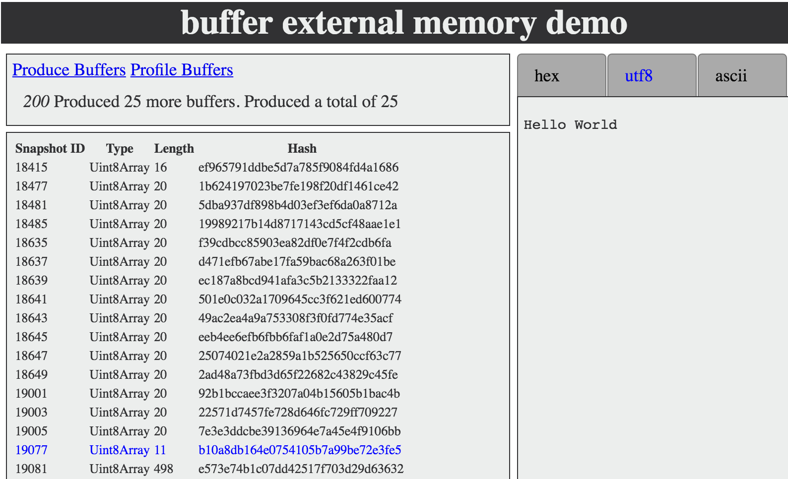

# external memory buffer demo

Demo showing how to capture external memory of buffers found in a heap snapshot taken with the v8-profiler.

This demo uses a fork of that module in order to add a method to find Buffer nodes inside a heapsnapshot by using the
`GetMaxSnapshotJSObjectId` and `GetNodeById` snapshot methods provided by v8. Please find the related PR
[here](https://github.com/thlorenz/v8-profiler/pull/1).

